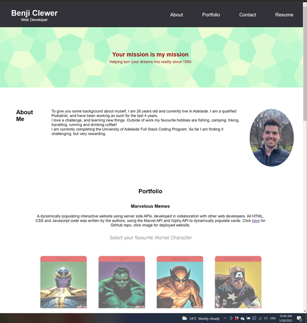
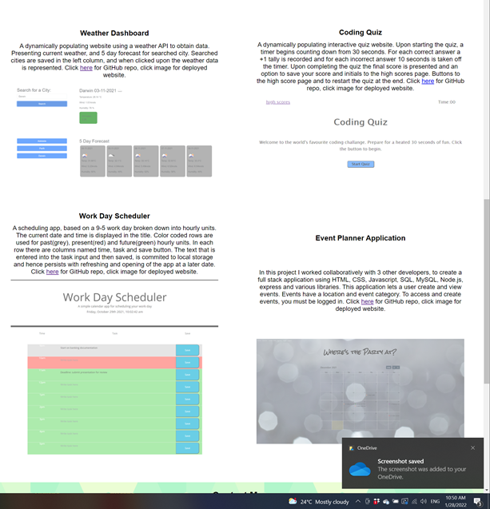
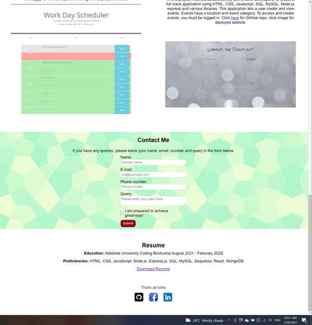

## React Portfolio


## Table of Contents
* [GitHub](#GitHub)
* [Description](#description)
* [Installation Instructions](#installation-instructions)
* [Usage Instructions](#usage-instructions)
* [Contribution Guidelines](#contribution-guidelines)
* [Test](#test)
* [Questions](#questions)
* [License](#license)

## GitHub
My GitHub username is B3nj1e. 
Please click [here](https://github.com/B3nj1e) to access my GitHub profile and the associated repository [here](https://github.com/B3nj1e/react-portfolio-app). To access the deploy application on Heroku please click [here](https://react-portfolio-demo.herokuapp.com/).

## Description
A personal portfolio page built using react, demonstrating current understanding of recent technologies. 

User story:
```md
AS AN employer looking for candidates with experience building single-page applications
I WANT to view a potential employee's deployed React portfolio of work samples
SO THAT I can assess whether they're a good candidate for an open position
```
Acceptance Criteria:

```md
GIVEN a single-page application portfolio for a web developer
WHEN I load the portfolio
THEN I am presented with a page containing a header, a section for content, and a footer
WHEN I view the header
THEN I am presented with the developer's name and navigation with titles corresponding to different sections of the portfolio
WHEN I view the navigation titles
THEN I am presented with the titles About Me, Portfolio, Contact, and Resume, and the title corresponding to the current section is highlighted
WHEN I click on a navigation title
THEN I am presented with the corresponding section below the navigation without the page reloading and that title is highlighted
WHEN I load the portfolio the first time
THEN the About Me title and section are selected by default
WHEN I am presented with the About Me section
THEN I see a recent photo or avatar of the developer and a short bio about them
WHEN I am presented with the Portfolio section
THEN I see titled images of six of the developer’s applications with links to both the deployed applications and the corresponding GitHub repositories
WHEN I am presented with the Contact section
THEN I see a contact form with fields for a name, an email address, and a message
WHEN I move my cursor out of one of the form fields without entering text
THEN I receive a notification that this field is required
WHEN I enter text into the email address field
THEN I receive a notification if I have entered an invalid email address
WHEN I am presented with the Resume section
THEN I see a link to a downloadable resume and a list of the developer’s proficiencies
WHEN I view the footer
THEN I am presented with text or icon links to the developer’s GitHub and LinkedIn profiles, and their profile on a third platform (Stack Overflow, Twitter)
```


## Installation Instructions
To use the application, please download all associated files off the [GitHub repository](https://github.com/B3nj1e/react-portfolio-app). Ensure node.js is installed. In the terminal run ``npm i`` to install the dependencies and packages. Once you have install the packages, run ``npm start`` to open the application in a local environment, and navigate to localhost:3000 in your browser.

## Usage Instructions
Designed to introduce myself to prospective employees, by detailing about me, portfolio, contact and resume sections in the application. 

## Contribution Guidelines
If you think you can improve this application, please feel free to make contributions. I will review these changes on GitHub prior to merging them to the main branch.

## Test
To quickly test the application, follow the installation instructions above and run on localhost or navigate to the deployed application on [heroku](https://text-editorjate.herokuapp.com/). Open the inspect function on your browser and check the following...

Below: Default appearance of application; name, header, navbar and about me section. 




Below: Portfolio section, detailing previous work.



Below: Contact form, Resume and footer with social media links.  




## Questions
If you have any questions or would like to report an issue with the application, please contact me vie my email at blankemail@email.com(left blank for privacy concerns). Alternative contact me via my [GitHub account](https://github.com/B3nj1e). 

## License
If you require more information concerning the license, please click [here](https://choosealicense.com/licenses/).

---------------------

MIT License

Copyright (c) 2021 B3nj1e

Permission is hereby granted, free of charge, to any person obtaining a copy
of this software and associated documentation files (the "Software"), to deal
in the Software without restriction, including without limitation the rights
to use, copy, modify, merge, publish, distribute, sublicense, and/or sell
copies of the Software, and to permit persons to whom the Software is
furnished to do so, subject to the following conditions:

The above copyright notice and this permission notice shall be included in all
copies or substantial portions of the Software.

THE SOFTWARE IS PROVIDED "AS IS", WITHOUT WARRANTY OF ANY KIND, EXPRESS OR
IMPLIED, INCLUDING BUT NOT LIMITED TO THE WARRANTIES OF MERCHANTABILITY,
FITNESS FOR A PARTICULAR PURPOSE AND NONINFRINGEMENT. IN NO EVENT SHALL THE
AUTHORS OR COPYRIGHT HOLDERS BE LIABLE FOR ANY CLAIM, DAMAGES OR OTHER
LIABILITY, WHETHER IN AN ACTION OF CONTRACT, TORT OR OTHERWISE, ARISING FROM,
OUT OF OR IN CONNECTION WITH THE SOFTWARE OR THE USE OR OTHER DEALINGS IN THE
SOFTWARE.